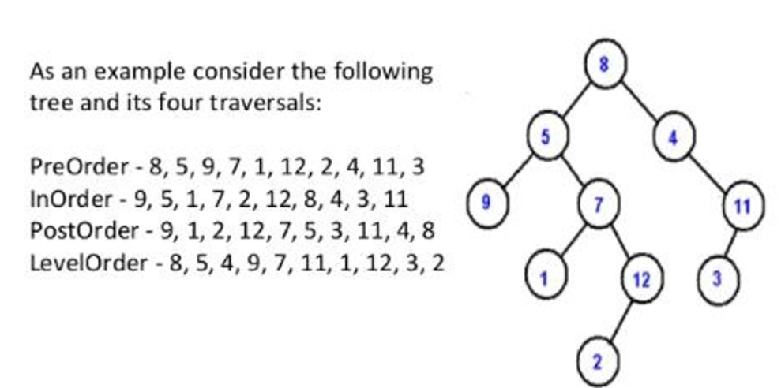

# Data Structure and Algorithm

## Methods for solving a problem

### Sorted Array

  
Methods

---

- **Binary Search**

  - find a certain element in the given sorted array, for eg: find a given number in a sorted array

---

- **Two Pointers**

  - search set of elements with a given condition, for eg: find two number in a 'sorted' array that sum up to a given target number
  - find triplets or a sub array with a given condition

---

- **Cyclic Sort**

  - find missing/duplicate/smallest number, where elements of the array are in a given range

---

- **Merge**

  - find the smallest/largest/or a specified element from N sorted array

---

- **Backtracking**

  - find some permutations or combinations of the array elements

---

- **Dynamic Programming**:
  - for eg: maximum subarray

---

### Unsorted Array

  
Methods

---

- **Using a Collection (like HashMap/HashSet/Stack/Queue etc)**

  - find a pair/group of numbers satisfying a given target condition, for eg: find two number in the array that sum up to a given target number

---

- **Sorting**

  - rearrange the given array elements in a specified way to obtain the output.

---

- **Simple Array Traversal**

  - find a single value or a transformation of the given array in some way

---

- **Two Pointers**

  - search set of elements with a given condition, for eg: container with most water
  - find triplets or a sub array with a given condition

---

- **Fast and Slow Pointer**

  - find the position of an element or the length of the array, whether the array is cyclic/has a loop

---

- **Two Heaps**

  - find the smallest/largest/median of elements of an array

---

- **Subsets**

  - permutation and combination of the given set

---

- **Top K Elements**

  - find the top K smallest/largest/frequent elements of the array

---

- **Sliding Window**

  - find the shortest/longest subset of the given array

---

- **Merge Intervals**

  - find overlapping intervals/mutually exclusive intervals/merge intervals given the input is a list/array of intervals [t1, t2]

---

- **Backtracking**

  - find some permutations or combinations of the array elements

---

- **Dynamic Programming**

  - When nothing of the above methods work

---

### Strings

  
Methods

---

- **Traverse like an array, optionally using a Collection**

  - traverse the given string from start to end, whilst validating or finding something, for eg: validate the parentheses of the given string

---

- **ASCII values approach**

- solve something based on the number of occurrences of the alphabets, for eg: find the first repetitive character in a string

---

- **One/More Pointers Approach**

  - search a substring/another string, for eg: implement strStr()

---

- **Sliding Window**

  - find the smallest/largest/or a conditional substring from the given string, for eg: find the longest substring without a repeating character

---

- **Backtracking**

  - find all permutation of a string

---

- **Dynamic Programming**

  - When nothing of the above methods work

---

### Linked List

  
Methods

---

- **Traverse + optional Collection**
  - traverse the given linked list from start to end, whilst validating or finding something, for eg: Adding two numbers represented by linked lists

---

- **Two Pointers approach**
  - perform an operation, given Nth node from the end of the list
  - list is cyclic
  - given are two lists that are merged

---

- **Linked Manipulation**
  - modify the given linked list in-place, for eg: reverse a linked list
  - perform an operation on two linked list, for eg: merge two sorted lists to give a single list

---

- **Recursion**
  - perform the same operation till a base case has been reached, for eg: reverse a linked list in groups of a given size

---

- **k-way merge**
  - given multiple sorted linked list, merge them into one sorted list

---

### Graph Traversal Methods

  
Methods

---

- **Depth First Search**

  - starts at the root of the graph and explores as far as possible along each path in the graph based on the condition for traversal/what is being searched

---

- **Breadth First Search**
  - starts at the root of the graph but explores it's neighbor nodes in the graph before moving to next level of neighbors

---

### Trees

  
Methods

---

1. **Recursion**

   - find an output that depends on smaller instance of the same problem that build up to the final solution

---

1. **4 traversal techniques of a tree**
   - level order
   - pre-order
   - in-order
   - post-order

---

