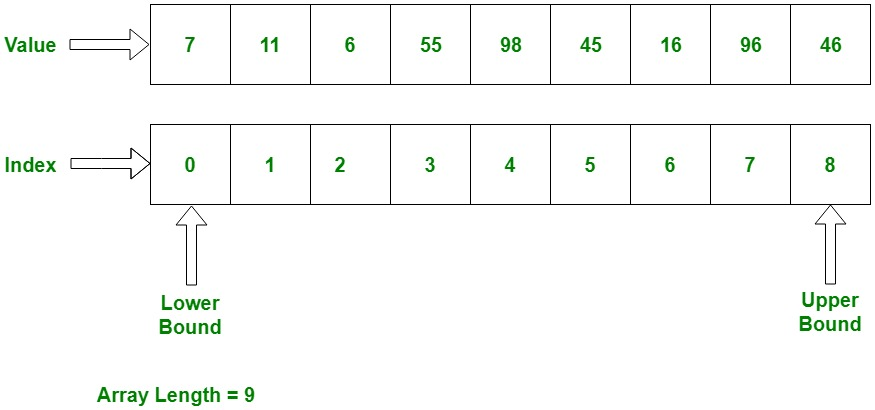
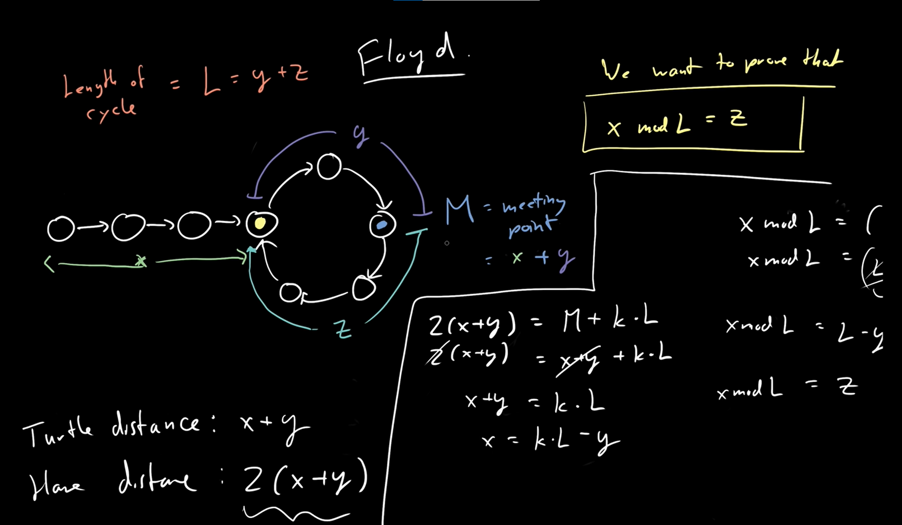

# Array

**Table of Contents**

- [Array](#array)
  - [Reverse the Array](#reverse-the-array)
  - [Min Max in an Array](#min-max-in-an-array)
  - [Find the kth max/min element in an Array](#find-the-kth-maxmin-element-in-an-array)
  - [Given an array which consists of only 0, 1, and 2. Sort without using sorting algo](#given-an-array-which-consists-of-only-0-1-and-2-sort-without-using-sorting-algo)
  - [Move all the negative elements to one side of the array](#move-all-the-negative-elements-to-one-side-of-the-array)
  - [Find the Union and Intersection of the two sorted arrays.](#find-the-union-and-intersection-of-the-two-sorted-arrays)
  - [Write a program to cyclically rotate an array by one.](#write-a-program-to-cyclically-rotate-an-array-by-one)
  - [Find largest contiguous sum](#find-largest-contiguous-sum)
  - [Minimize the max difference b/w two heights](#minimize-the-max-difference-bw-two-heights)
  - [Minimum no. of jumps to reach end of an array](#minimum-no-of-jumps-to-reach-end-of-an-array)
  - [Find duplicate in an array of N + 1 integers](#find-duplicate-in-an-array-of-n--1-integers)
  - [Best time to buy and sell stock](#best-time-to-buy-and-sell-stock)
  - [Find all pairs on integer array whose sum is equal to given number](#find-all-pairs-on-integer-array-whose-sum-is-equal-to-given-number)
  - [Count Inversions](#count-inversions)
  - [Find common elements in 3 sorted arrays](#find-common-elements-in-3-sorted-arrays)
  - [Rearrange the array in alternating positive and negative items with O(1) extra space](#rearrange-the-array-in-alternating-positive-and-negative-items-with-o1-extra-space)
  - [Subarray with 0 sum](#subarray-with-0-sum)
  - [Find factorial of a large number](#find-factorial-of-a-large-number)
  - [Find the maximum product subarray](#find-the-maximum-product-subarray)
  - [Longest consecutive subsequence](#longest-consecutive-subsequence)
  - [Given an array of size n and a number k, find all elements that appear more than 'n/k' times](#given-an-array-of-size-n-and-a-number-k-find-all-elements-that-appear-more-than-nk-times)
  - [Find whether an array is a subset of another array](#find-whether-an-array-is-a-subset-of-another-array)
  - [Tripple sum](#tripple-sum)
  - [Trapping Rain water problem](#trapping-rain-water-problem)
  - [Chocolate Distribution Problem](#chocolate-distribution-problem)
  - [Smallest Subarray exceeding a given sum](#smallest-subarray-exceeding-a-given-sum)
  - [Three way partitioning of an array](#three-way-partitioning-of-an-array)

---

## Reverse the Array

  
Information

- make two pointers, pointing to **start** and **end**
- swap elements in start and end with each other
- increment start and decrement end up until start is not greater than end

## Min Max in an Array

  
Information

- There are three ways to do it

1. Linear Traversal, tracking max and min value and updating them respectively
2. Dividing the array into two halves and finding two max and two min.
   Comparing them and returning appropriate values.
3. Comparing them in pairs. If length of the array is odd, assign max and min to first and compare other items in pairs, else assign max and min to first two elements in the array and take a subsequent pair and compare them with the max and min and update them respectively.

## Find the kth max/min element in an Array

  
Implementation

- Use Sorting and return the element in $O(logn)$ time
- Use MaxHeap/MinHeap method and pop elements to find kth element in $O(logn)$ time
- Use QuickSelect Method to find the element in worst case $O(n^2)$ but in average case $O(n)$ time

1. using QuickSelect paradigm to solve the problem,

- find the partition position
- find if the position is correct
- if position is greater than kth index, search in the left half
- otherwise, search in the right side

## Given an array which consists of only 0, 1, and 2. Sort without using sorting algo

  
Implementation

- use three pointers, low, mid, high to demarcate the last index at which range of 0s, 1s, and 2s lies.
- iterate through the entire array and swap unknown values in their respective domain
- 0 to low will have values of 0s
- low = 0, mid = 0 and high = len(items) - 1
- if the element is 0 then swap the element at index low and update low = low + 1, and mid = mid + 1
- if the element is 1, update mid = mid + 1
- if the element is 2 then swap the element with element at high, and update high = high - 1 and update i = i - 1
- Time Complexity is, $O(n)$
- Space Complexity is, $O(1)$

## Move all the negative elements to one side of the array

  
Implementation

> There are two methods

1. Use quick partition method to partition the array in linear time
2. Use two pointer method and swap the elements whenever it failed the constraints.

- Time Complexity is, $O(n)$
- Space Complexity is, $O(1)$

## Find the Union and Intersection of the two sorted arrays.

  
Implementation

> There are several ways to do that

1. Naive way of storing all first array elements and check the second array elements
   - Time Complexity is, $O(nm)$
1. Use of Hash
   - Time Complexity is, $O(n + m)$
1. Use of Map
   - Time Complexity is, $O(n + m)$
1. Use of Merge Operation
   - Time Complexity is, $O(n + m)$

## Write a program to cyclically rotate an array by one.

  
Implementation

- cycle in array signifies the direction from left to right
- store last value in a variable
- shift all items in the array on position to the right from first to last(exclusive)
- store at first position the value that you've stored earlier
- Time Complexity is, $O(n)$
- Space Complexity is, $O(1)$

## Find largest contiguous sum

  
Implementation

> There are two methods

1. Divide and Conquer

   - We can divide the array into three sections, whole array, left half, and right half
   - calculate the max contiguous subarray in each section and return the max value
   - Time Complexity is, $O(nlogn)$
   - Space Complexity is, $O(1)$

2. Kadane's Algorithm
   - The simple idea of Kadane's algorithm is to look for all positive contiguous segments of the array (max_ending_here is used for this).
   - And keep track of maximum sum contiguous segment among all positive segments (max_so_far is used for this)
   - Each time we get a positive-sum compare it with max_so_far and update max_so_far if it is greater than max_so_far
   - Time Complexity is, $O(n)$
   - Space Complexity is, $O(1)$

## Minimize the max difference b/w two heights

  
Implementation

- Make an array of all possible heights > 0 using the value of k
- sort the array
- find the index upto which height of every tower is included from the starting. Initialize the answer to the difference between height at this index and starting index
- Then with the help of two pointer technique increment the left pointer which was initially at 0 such that one of the tower is not included
- Similarly increment right pointer to make all towers included and update the answer.
- Do this until end of the array
- Time Complexity is, $O(nlogn)$
- Space Complexity is, $O(n)$

## Minimum no. of jumps to reach end of an array

  
Implementation

- We can use dynamic approach to solve this problem
- Time Complexity is, $O(nm)$
- Space Complexity is, $O(n)$

## Find duplicate in an array of N + 1 integers

  
Implementation

> There are three methods to solve this problem

1. Sorting and finding the duplicate

   - Time Complexity is, $O(nlogn)$
   - Space Complexity is, $O(1)$

2. Using Set and find the duplicate

   - Time Complexity is, $O(n)$
   - Space Complexity is, $O(n)$

3. Using Floyd's Hare and Tortoise technique

## Best time to buy and sell stock

  
Implementation

1. Brute Force method, iterate over every pair to find the max price for buy and sell

- Time Complexity is, $O(n^2)$
- Space Complexity is, $O(1)$

1. Kadane's Algorithm

   - We need to find the largest peak following the smallest valley.
   - we can maintain two variables - min_price and max_profit corresponding to the smallest valley and maximum profit
   - Time Complexity is, $O(n)$
   - Space Complexity is, $O(1)$

## Find all pairs on integer array whose sum is equal to given number

  
Implementation

1. Brute force pair method

2. HashMap method
   - Time Complexity is, $O(n)$
   - Space Complexity is, $O(n)$

## Count Inversions

  
Implementation

1. Brute force method

   - Time Complexity is, $O(n^2)$
   - Space Complexity is, $O(1)$

1. MergeSort and Merge Method
   - divide the array into two equal or almost equal halves in each step until the base case is reached
   - create a function merge, and calculate total number of inversions
   - if array[i] is greater than array[j], then number of inversions is mid - i
   - calculate the inversions in the left side of the array
   - calculate the inversions in the right side of the array
   - calculate the inversions in the merge step of the sort
   - return number of inversions
   - Time Complexity is, $O(nlogn)$
   - Space Complexity is, $O(n)$

## Find common elements in 3 sorted arrays

  
Implementation

- create three pointers, i, j, and k
- if i == j == k, store value and increment all pointers
- if i < j, increment i
- if j < k, increment j
- else k is smallest and increment k
- Time Complexity is, $O(n + m + o)$
- Space Complexity is, $O(n + m + o)$

## Rearrange the array in alternating positive and negative items with O(1) extra space

  
Implementation

1. Right rotate method

   - Time Complexity is, $O(n^2)$
   - Space Complexity is, $O(1)$

2. Sorting method
   - Time Complexity is, $O(nlogn)$
   - Space Complexity is, $O(1)$

## Subarray with 0 sum

  
Implementation

1. Use of prefix array
   - There will be two duplicate elements in the prefix array
   - use hash to find out the duplicates and their index
   - Time Complexity is, $O(n)$
   - Space Complexity is, $O(n)$

## Find factorial of a large number

  
Implementation

- Create an array of max_size
- do a carry multiplication on it
- return the result from right to left
- Space Complexity is, $O(1)$
- Time Complexity is, $O(n)$

## Find the maximum product subarray

  
Implementation

- The idea behind finding the solution is taking the use of kadane'e algorithm
- we store the min_value and max_value
- at ith index, if value is positive, max_value should be updated
- at ith index, if value is negative, interchange min_value and max_value
- Time Complexity is, $O(n)$
- Space Complexity is, $O(1)$

## Longest consecutive subsequence

  
Implementation

1. Sorting

   - Sort the array
   - and count the consecutive elements in the array
   - Time Complexity is, $O(nlogn)$
   - Space Complexity is, $O(1)$

1. Hash/Set
   - Use hash to store every element in one pass
   - declare a max_count
   - element at ith index, find element - 1 in hash
   - if present continue, otherwise it is the first element in the subsequence
   - find whether the consecutive elements already there in hash/set
   - increment count
   - compare it with max_count, and change it's value if max_count is less than count
   - Time Complexity is, $O(n)$
   - Space Complexity is, $O(n)$

## Given an array of size n and a number k, find all elements that appear more than 'n/k' times

  
Implementation

1. Sorting
2. Hashing
3. k - 1 array method
   - create a temporary array of size (k - 1) to store elements and their counts
   - traverse through input array and update temp[] (add/remove an element or increase/decrease count) for every traversed element.
   - Iterate through final (k - 1) potential candidates or every element, check if it actually has count more than n/k. This step takes O(nk) time.

## Find whether an array is a subset of another array

  
Implementation

- create a hash table to store the elements in a1
- traverse through a2 and find whether the element is present in the hash table
- return true if all elements are present in the hash table
- else return false
- Space Complexity is, $O(n)$
- Time Complexity is, $O(n)$

## Tripple sum

  
Implementation

1. Naive approach of brute force

   - Time Complexity is, $O(n^3)$
   - Space Complexity is, $O(1)$

1. Sorting method

   - sort the array
   - iterate through the array
   - for each element find the pair (sum - el) in linear time using two pointer method
   - if sum - el if found return the tripplet, else continue
   - Time Complexity is, $O(n^2)$
   - Space Complexity is, $O(1)$

1. Hashing method

   - Time Complexity is, $O(n^2)$
   - Space Complexity is, $O(n)$

## Trapping Rain water problem

  
Implementation

1. Brute Force method

   - iterate through the entire array
   - for each element in the array find the high tower size in the left side and in the right side
   - take the min of these and subtract with the height of current tower
   - you get the water height in the current tower
   - calculate for every tower, you will get height of water flooding
   - Time Complexity is, $O(n^2)$
   - Space Complexity is, $O(1)$

2. Single Iteration method
   - find the highest tower in the left half for a particular tower at ith index
   - find the highest tower in the right half for a particular tower at ith index
   - get min of these and subtract with current tower height
   - add all these values to get the height of the water
   - Time Complexity is, $O(n)$
   - Space Complexity is, $O(n)$

## Chocolate Distribution Problem

  
Implementation

1. Naive Approach

   - create all the subset of size m
   - find min(max - min) within all subsets
   - Time Complexity is, $O(2^n)$
   - Space Complexity is, $O(n)$

1. Sorting and Sliding window method
   - sort all the chocolates in non-decreasing order
   - set a window and find the min difference
   - increment the window and replace the min difference with the appropriate value
   - return min_difference

## Smallest Subarray exceeding a given sum

  
Implementation

1. Brute Force method to find the pairs and calculate sum and find the min length

   - Time Complexity is, $O(n^2)$
   - Space Complexity is, $O(1)$

1. Sliding window technique
   - initialize start_index and sum variable
   - calculate find the index at which the sum > sum_given
   - store min_length (i - start)
   - increment start till sum < sum_given
   - return min_length
   - Time Complexity is, $O(n)$
   - Space Complexity is, $O(1)$

## Three way partitioning of an array

  
Implementation

1. Sorting
2. Parition method
   - create start and end variable
   - iterate through the element with given index
   - swap if nums[i] < nums[start], and start++, i++
   - swap if nums[i] > nums[end], and end--, i++
   - if i >= end, return
   - Time Complexity is, $O(n)$
   - Space Complexity is, $O(1)$

