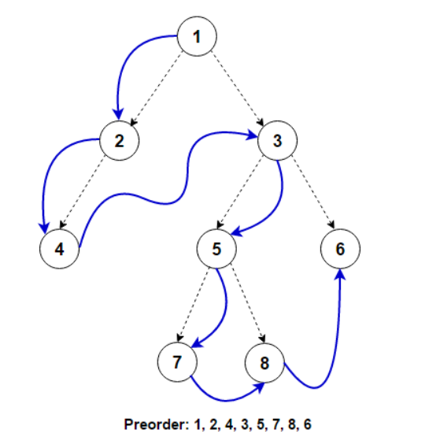

# Binary Trees

- [Binary Trees](#binary-trees)
  - [Level Order Traversal](#level-order-traversal)
  - [Reverse Level Order Traversal](#reverse-level-order-traversal)
  - [Height of a tree](#height-of-a-tree)
  - [Find the diameter of a tree](#find-the-diameter-of-a-tree)
  - [Create a mirror tree](#create-a-mirror-tree)
  - [Inorder Traversal](#inorder-traversal)
  - [Preorder Traversal](#preorder-traversal)
  - [Postorder Traversal](#postorder-traversal)

## Level Order Traversal

  
Implementation

- Creating a Binary Tree
- Apply Queue to print level order
- For printing each level in seperate lines use total_current_nodes and total_next_nodes

## Reverse Level Order Traversal

  
Implementation

- use queue and stack to achieve it
- use queue to traverse level by level and stack to append it
- print stack.pop() while not empty
- Time Complexity is, $O(n)$
- Space Complexity is, $O(n)$

## Height of a tree

  
Implementation

- max(left, right) + 1
- Time Complexity is, $O(n)$
- Space Complexity is, $O(height)$

## Find the diameter of a tree

  
Implementation

- use recursion
- find the diameter in the left and right subtree
- find the diamter including the current root
- return the max of these
- Time Complexity is, $O(n^2)$
- Space Complexity is, $O(height)$

## Create a mirror tree

  
Implementation

- use recursion
- if root == None, return None
- create a mirror = new_node(root.value)
- mirror.right = mirrorify(root.left, mirror.right)
- mirror.left = mirrorify(root.right, mirror.left)
- return mirror
- Time Complexity is, $O(n)$
- Space Complexity is, $O(height)$

## Inorder Traversal

  
Implementation

- left, print(parent), right
- use recursion
- or stack
- non-decreasing order in case of binary search tree
- Time Complexity is, $O(n)$
- Space Complexity is, $O(height)$
  

## Preorder Traversal

  
Implementation

- print(parent), recur left, recur right
- use recursion
- use stack
- Time Complexity is, $O(n)$
- Space Complexity is, $O(height)$
  

## Postorder Traversal

  
Implementation

- recur left, recur right, print(parent)
- use recursion
- use two stack method
- print the second stack
- Time Complexity is, $O(n)$
- Space Complexity is, $O(n)$

